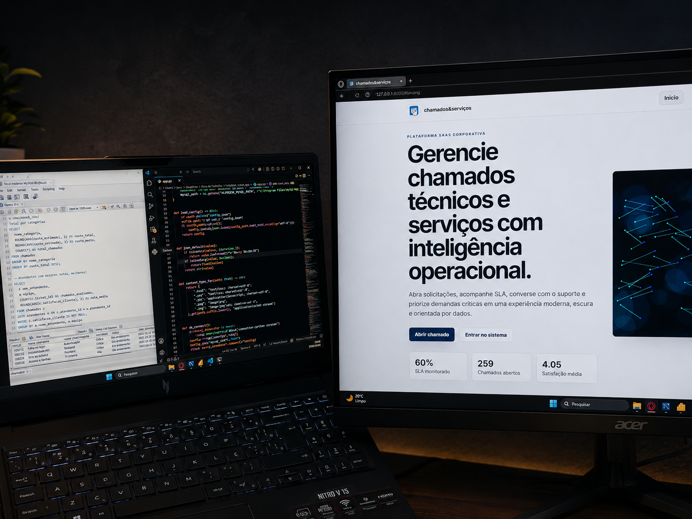
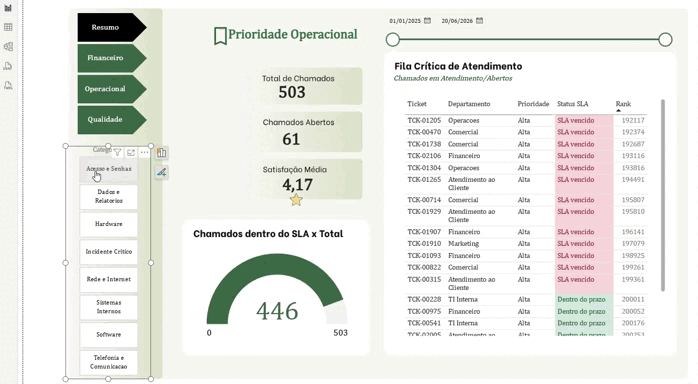

<div align="center">



<br/>

# chamados&serviços

**Solução de help desk com pipeline de dados**

Aplicação que simula o ciclo real de suporte técnico corporativo, da abertura do chamado até o dashboard analítico em Power BI, passando por uma API Python e banco MySQL.

[](https://python.org)
[](https://mysql.com)
[](https://developer.mozilla.org/en-US/docs/Web/JavaScript)
[](https://developer.mozilla.org/en-US/docs/Web/HTML)
[](https://developer.mozilla.org/en-US/docs/Web/CSS)
[](https://powerbi.microsoft.com)
[](https://jeeescaribeiro-code.github.io/chamados-servicos)

</div>

---

## Demonstração Online

<div align="center">

[](https://jeeescaribeiro-code.github.io/chamados-servicos)

</div>

A versão publicada no **GitHub Pages** apresenta a interface estática do projeto para visualização rápida.

> A aplicação completa depende da **API Python** e do **banco MySQL local**, então funcionalidades como cadastro, persistência de chamados, chat e atualização do Power BI exigem a execução local.

---

## Visão Geral

Este projeto simula uma solução real de help desk corporativo com quatro camadas integradas:

```
App Web (HTML/CSS/JS)
    ↓
API Local (Python)
    ↓
Banco de Dados (MySQL)
    ↓
Análise & BI (Power BI + DAX)
```

A ideia central foi replicar o fluxo que existe dentro de empresas de suporte — onde chamados precisam ser rastreados, priorizados, associados a SLAs e depois virar indicador de gestão.

---

## Dashboard Power BI

<div align="center">

</div>

---

## Funcionalidades

**Usuário final**
- Abertura de chamados com sugestão automática de categoria, prioridade e SLA baseada no texto digitado
- Acompanhamento de chamados com status, responsável e prazo
- Chat com histórico e timeline por chamado
- Dashboard pessoal com resumo de solicitações

**Atendente / Administrador**
- Fila de chamados com filtros de prioridade e vencimento
- Painel com indicadores em tempo real
- Base de conhecimento e catálogo de serviços

---

## Modelagem do Banco (`helpdesk_sla`)

| Tabela | Conteúdo |
|---|---|
| `app_usuarios` | Autenticação (login/cadastro) |
| `usuarios` | Perfil completo do usuário |
| `chamados` | Registro principal dos chamados |
| `chamado_detalhes` | Título e descrição |
| `chamado_comentarios` | Mensagens do chat |
| `chamado_historico` | Eventos da timeline |
| `categorias` | Tipos de chamado disponíveis |
| `sla_regras` | Prazos por prioridade/categoria |
| `atendentes` | Equipe de suporte |
| `departamentos` | Estrutura organizacional |

---

## Indicadores Analíticos (Power BI + DAX)

- Volume total de chamados e status atual
- % dentro e fora do SLA
- Fila crítica: prioridade × vencimento
- Custo por categoria e departamento
- Atendentes com melhores avaliações
- Satisfação média dos usuários
- Perfil de usuário que mais demanda suporte

---

## Como Rodar Localmente

**Pré-requisitos:** Python 3.x, MySQL 8.x instalado e rodando

**1. Configure a conexão**

Crie um arquivo `config.json` na raiz do projeto:

```json
{
  "host": "localhost",
  "port": 3306,
  "user": "root",
  "password": "SUA_SENHA_AQUI",
  "database": "helpdesk_sla",
  "mysql_path": "C:\\Program Files\\MySQL\\MySQL Server 8.0\\bin\\mysql.exe"
}
```

**2. Execute a aplicação**

Clique duas vezes em `run_app.bat` ou rode pelo terminal:

```bash
run_app.bat
```

## Power BI

Conecte o Power BI diretamente ao banco `helpdesk_sla` via MySQL.

- **Modo Importar:** clique em *Atualizar* após abrir novos chamados no app


## O que esse projeto cobre

Esse projeto foi uma forma de conectar conceitos que geralmente ficam separados em curso: modelagem relacional, integração entre camadas, análise de dados e visualização. Na prática, precisei pensar no banco de dados como fonte de verdade para três consumidores diferentes ao mesmo tempo — a aplicação web, a API e o Power BI — e garantir que os dados escritos em um lugar chegassem corretamente no outro.

A lógica de sugestão automática de categoria e SLA foi a parte mais interessante: o sistema analisa o texto do chamado e tenta inferir o tipo de problema e o prazo adequado, o que exigiu pensar em regras de negócio além do CRUD.

---

<div align="center">

**This project** simulates a full corporate help desk solution — ticket management, SLA tracking, and BI analytics — built with Python, MySQL, and Power BI.

It covers the complete data lifecycle: a web app writes structured data through a local API to a relational database, which then feeds a Power BI dashboard with KPIs like SLA compliance, cost by category, and team performance metrics.

*Demo estática disponível no [GitHub Pages](https://jeeescaribeiro-code.github.io/chamados-servicos). Para usar a aplicação completa, execute o projeto localmente com Python e MySQL.*

</div>
